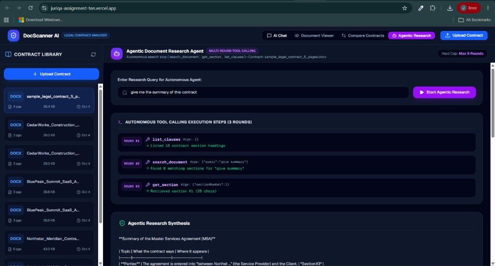
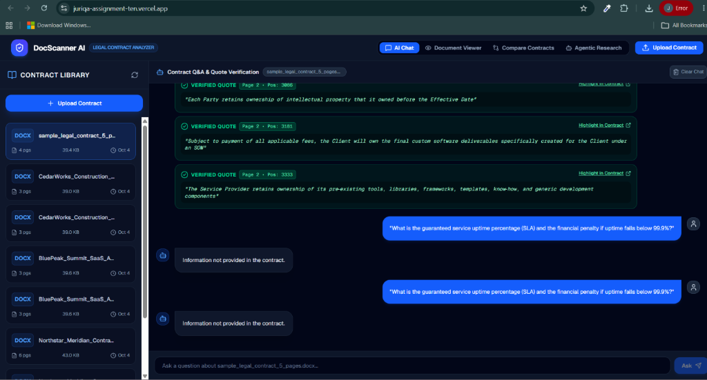
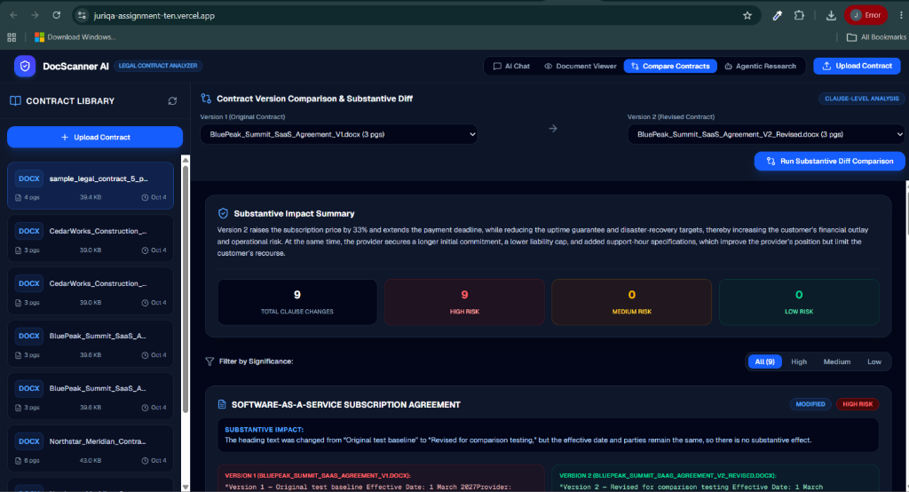

# ⚖️ JuriQA — AI-Powered Legal Document Intelligence & Contract Analytics Platform

A state-of-the-art AI legal technology platform built with **Next.js 16**, **TypeScript**, **MongoDB Atlas**, **Vercel AI SDK**, and a **Multi-Tier AI Provider System (Groq API + Google Gemini API)**.

JuriQA provides contract analysis, version comparison, quote verification, and autonomous agentic research across legal agreements.

---

## 🔗 Quick Links & Live Demos

* 🌐 **Live Web Application**: [juriqa-assignment-ten.vercel.app](https://juriqa-assignment-ten.vercel.app/)
* 📹 **YouTube Demo Video**: [Watch Demo Video on YouTube](https://youtu.be/OIb0fSe2lME)
* 📘 **Engineering Notes & Architecture**: [Read `ENGINEERING_NOTES.md`](ENGINEERING_NOTES.md)

---

## 🌟 Key Features & Screenshots

### 1. 🤖 Autonomous Agentic Document Research
*Multi-round tool calling loop (`list_clauses`, `search_document`, `get_section`) with live execution logs:*



* **Multi-Round Tool Calling**: Runs an autonomous investigation loop using tool lookups before formulating answers.
* **Real-Time Execution Logs**: Displays live terminal logs of every tool step for transparency.

---

### 2. 💬 Verified Quote Contract Q&A
*Grounded answer streaming with double-quoted verbatim contract proof, page numbers, and missing info handlers:*



* **Strict Grounded Q&A**: Answers user queries using ONLY information present in the contract.
* **Quote Precision & Verification**: Extracts exact double-quoted verbatim contract excerpts and verifies them against source text with position & page tracking.
* **Clear Chat Management**: Delete and clear chat history per document.

---

### 3. 📑 Dynamic Contract Comparison Engine
*Substantive risk summaries, High/Medium/Low risk cards, and word-level addition/deletion highlights:*



* **Clause-Level Diff Alignment**: Aligns matching clauses across contract versions using BM25 semantic retrieval, even when section numbers change.
* **Word-Level Highlighting**: Computes exact character and word-level modifications (`diffWords`) with visual deletion/addition highlights.
* **Numeric & Monetary Shift Extraction**: Detects shifts in fees, percentages, notice periods, warranty durations, and liability caps.
* **Legal Risk Severity Scoring**: Automatically rates risk impact as `High`, `Medium`, or `Low` based on legal exposure.

---

### 4. ⚡ Multi-Tier AI Resilience Architecture
- **Groq API Primary**: High-throughput execution using Groq endpoints (`https://api.groq.com/openai/v1`).
- **Google Gemini Backup**: Automatic fallback to Gemini API (`gemini-1.5-flash`) if primary quotas or limits are reached.
- **Local BM25 Fail-Safe**: Ensures 0% downtime by falling back to local BM25 clause alignment if external AI APIs hit rate limits.

---

## 🏗️ Architecture & Technology Stack

| Layer | Technology |
| :--- | :--- |
| **Framework** | [Next.js 16](https://nextjs.org/) (App Router + Turbopack) |
| **Language** | TypeScript (Strict Mode) |
| **Database** | [MongoDB Atlas](https://www.mongodb.com/atlas) + Mongoose |
| **AI Framework** | Vercel AI SDK (`ai`, `@ai-sdk/openai`, `@ai-sdk/google`) |
| **Primary LLM** | Groq API (`openai/gpt-oss-20b`, `llama-3.3-70b-versatile`) |
| **Backup LLM** | Google Gemini API (`gemini-1.5-flash`, `gemini-3.8-flash`) |
| **Retrieval Engine** | Local BM25 Semantic Retriever |
| **Diff Engine** | `diff` (Word-level diff algorithm) |

---

## 📂 Project Structure

```text
docscanner/
├── docs/
│   ├── assets/                             # UI Screenshots & Media Assets
│   └── ENGINEERING_NOTES.md                # Technical Decisions, BM25 & Fallback Notes
├── src/
│   ├── app/
│   │   ├── api/
│   │   │   ├── agentic/research/route.ts  # Autonomous Agentic Research Endpoint
│   │   │   ├── chat/route.ts              # Contract Q&A (POST/GET/DELETE)
│   │   │   ├── chat/verify/route.ts       # Quote Verification Endpoint
│   │   │   ├── documents/compare/route.ts # Contract Comparison Engine Endpoint
│   │   │   └── documents/upload/route.ts  # PDF/DOCX Parser & Ingestion Route
│   │   └── page.tsx                        # Main Workspace Interface
│   ├── components/
│   │   ├── AgenticResearchView.tsx         # Agentic Research UI Component
│   │   ├── ChatInterface.tsx               # Verified Quote Chat Interface
│   │   ├── CompareView.tsx                 # Contract Diff Visualizer Component
│   │   └── DocumentViewer.tsx              # Native Contract Viewer & Highlighter
│   ├── lib/
│   │   ├── aiProvider.ts                   # Groq & Gemini Fallback Factory
│   │   ├── comparator.ts                   # BM25 Clause Alignment & Diff Engine
│   │   ├── mongodb.ts                      # MongoDB Connection Caching
│   │   ├── quoteVerifier.ts                # Verbatim Quote Matching Algorithm
│   │   └── retriever.ts                    # Local BM25 Text Chunk Indexer
│   └── models/
│       ├── ChatMessage.ts                  # Chat Messages Schema
│       └── Document.ts                     # Contract Documents Schema
├── .env                                    # Environment Variables
├── next.config.ts                          # Next.js Configuration
└── package.json                            # Dependencies & Scripts
```

---

## ⚙️ Environment Setup

Create a `.env` or `.env.local` file in the root directory:

```env
# MongoDB Database Connection
MONGODB_URI=mongodb+srv://<username>:<password>@cluster0.bwp2q.mongodb.net/docscanner?retryWrites=true&wma=true

# Groq API Configuration (Primary)
AI_PROVIDER=groq
AI_API_KEY=gsk_your_groq_api_key_here
AI_BASE_URL=https://api.groq.com/openai/v1
AI_MODEL=openai/gpt-oss-20b

# Gemini API Configuration (Automatic Fallback Backup)
GEMINI_API_KEY=your_gemini_api_key_here
GEMINI_MODEL=gemini-1.5-flash
```

---

## 🚀 Getting Started

### 1. Install Dependencies
```bash
npm install
```

### 2. Run Development Server
```bash
npm run dev
```

Open [http://localhost:3000](http://localhost:3000) in your browser.

---

## 📡 API Endpoints Summary

| Endpoint | Method | Description |
| :--- | :--- | :--- |
| `/api/documents/upload` | `POST` | Upload & parse PDF/DOCX contract documents into MongoDB. |
| `/api/documents` | `GET` | Retrieve list of all uploaded contract documents. |
| `/api/chat` | `GET` | Fetch chat history for a specific document. |
| `/api/chat` | `POST` | Stream AI response with grounded context and quote verification. |
| `/api/chat` | `DELETE` | Clear all chat history associated with a document. |
| `/api/documents/compare` | `POST` | Execute clause comparison and legal risk analysis between two contracts. |
| `/api/agentic/research` | `POST` | Run multi-round autonomous tool-calling investigation loop. |

---

## 📜 Technical Documentation
For deep technical insights on how BM25 chunking handles 896-page contracts and how multi-tier provider fallbacks are implemented, please read [**`ENGINEERING_NOTES.md`**](ENGINEERING_NOTES.md).
